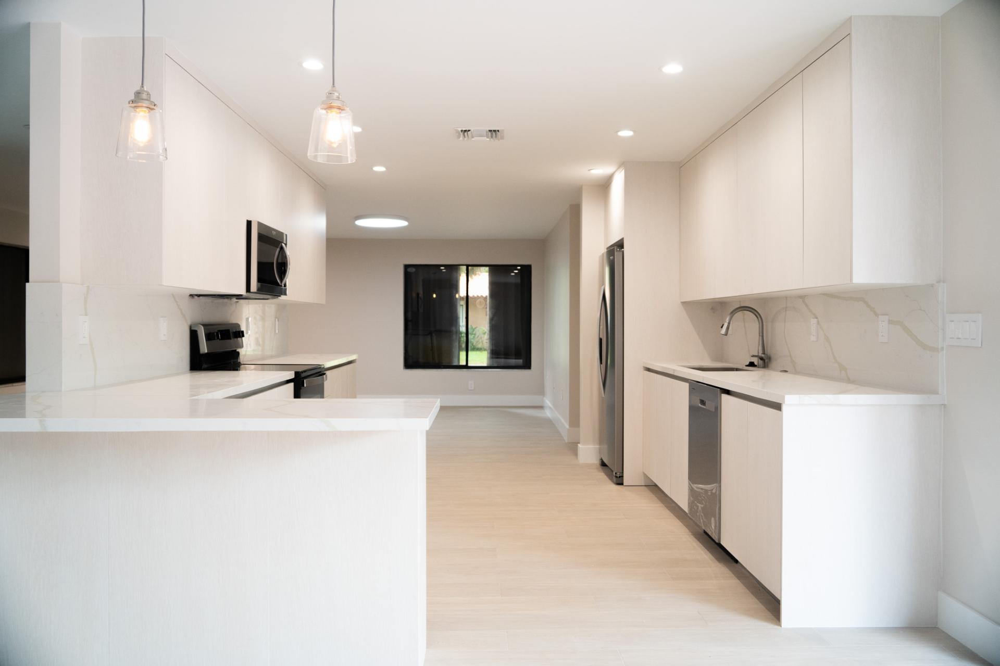
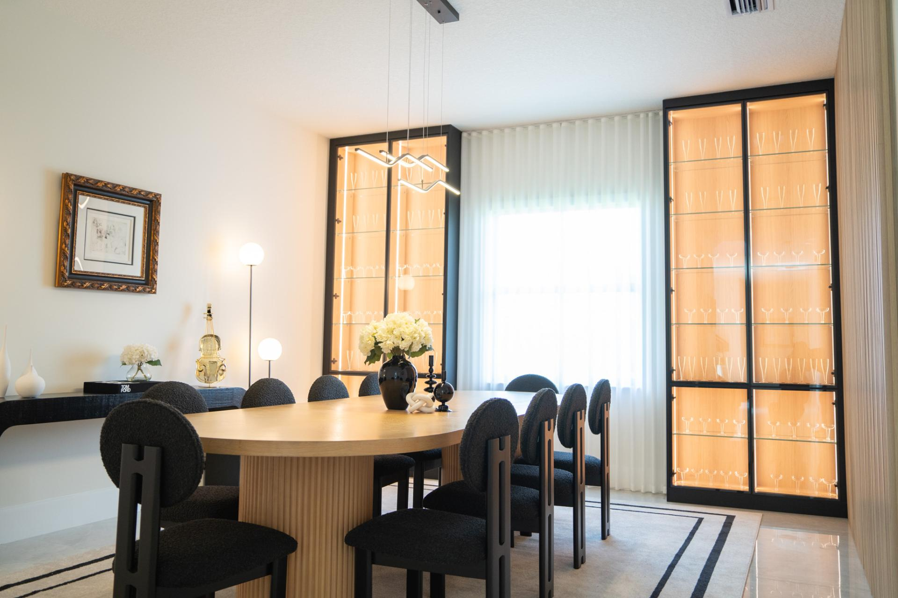
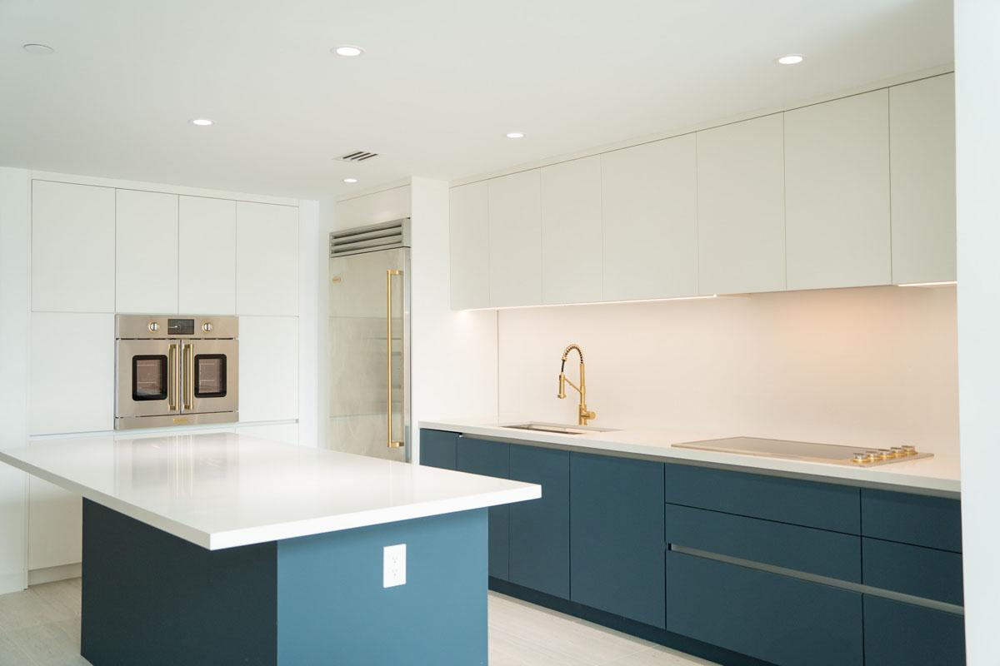
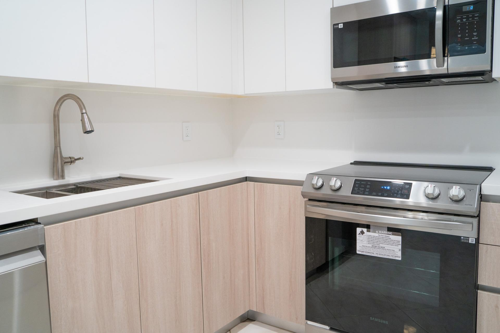
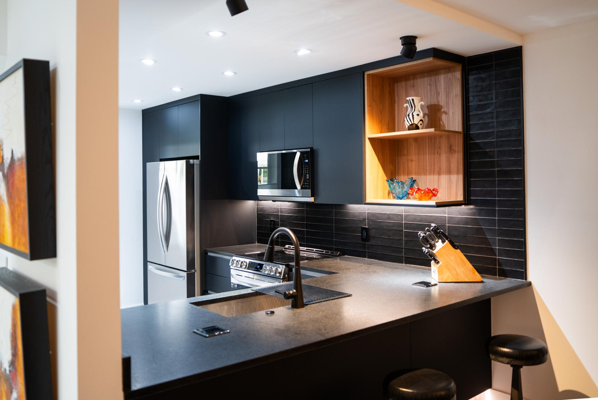
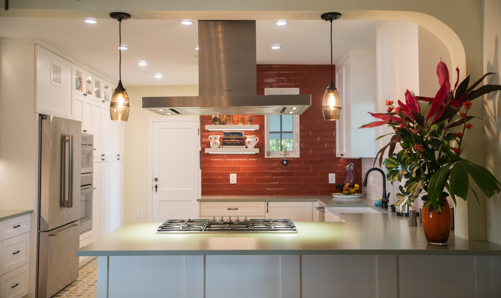

# WOODLOT, INC. - Custom Cabinetry & Millwork Solutions

**Your Premier Destination for Luxury Custom Cabinetry in South Florida**

---

## Welcome to WOODLOT

Since 2021, WOODLOT has been transforming South Florida homes and businesses with exceptional custom cabinetry and millwork solutions. We are a **family-owned carpentry company** based in Miami, dedicated to crafting beautiful, functional spaces that reflect your unique vision.

**WOODWORK - LUXURY - BESPOKE**

---

## Who We Are

At WOODLOT, we believe in the power of craftsmanship. Our team of skilled artisans specializes in creating custom woodworking projects that combine impeccable design with functional excellence. Our **passion** for carpentry runs deep in our family, and we take great pride in every detail of our work.

Established in 2021, we've quickly become known throughout South Florida for our exceptional quality and personalized service. Whether you're looking to:
- Build custom kitchen cabinets that elevate your culinary space
- Create custom closets that maximize storage and style
- Design custom vanities that transform your bathroom
- Craft custom wall units that showcase your collections
- Or create one-of-a-kind furniture pieces

We're here to bring your vision to life.

---

## Our Promise to You

We don't just create cabinetry—we create experiences. WOODLOT's Promise is built on four core commitments:

### 1. Personalized Service
We are committed to understanding your unique needs and preferences, ensuring an experience tailored exclusively to you. Our expert design team works closely with you throughout the entire process, making sure your voice is heard at every step.

### 2. Wide Selection Available
Our curated selection boasts unique pieces that exude luxury and make a statement that's unmistakably you. From traditional to contemporary styles, from classic finishes to innovative designs, we offer a vast array of options to suit your preferences.

### 3. High Quality Materials
We spare no expense in sourcing the highest quality materials, ensuring each piece is crafted to perfection without compromising on luxury. Each piece of wood is carefully chosen for its grain pattern, strength, and durability. Your investment deserves nothing less than the best.

### 4. Guaranteed Customer Satisfaction
From design to delivery, every aspect is meticulously crafted to exceed your expectations. Your satisfaction is our ultimate goal, and we stand behind every piece we create.

---

## Our Services

### Custom Kitchen Cabinets

**Elevate Your Kitchen with Custom Cabinetry**

Your kitchen is the heart of your home, and it deserves to be extraordinary. At WOODLOT, we understand the significance of kitchen cabinetry in creating a space that not only reflects your personal taste but also optimizes organization and storage.

With innovative storage solutions, our custom kitchen cabinets maximize every inch of your kitchen space while reducing clutter. Our designs transform your kitchen into a stunning culinary haven that combines aesthetic appeal with functional design.

**Why Choose WOODLOT for Kitchen Cabinets?**
- Meticulously handcrafted with impeccable attention to detail
- Built to last with exceptional quality and longevity
- Expert design team that understands your vision
- Wide range of styles, materials, finishes, and hardware options
- Seamless blend of beauty and functionality

Whether you have a compact urban kitchen or a spacious country-style kitchen, we can create custom cabinets that maximize your space's potential. Our designers work closely with you to understand your needs and lifestyle, making the most of every inch.

> "Take your kitchen up a few notches"

### Custom Closets

**Organization Meets Style**

A well-designed closet is more than just storage—it's a personal sanctuary. WOODLOT specializes in creating custom closets that maximize your space while reflecting your lifestyle and personality.

Our custom closet designs are tailored to your specific needs, whether you're looking for:
- A luxurious master closet with premium finishes
- A functional family closet with efficient organization
- A walk-in closet with innovative storage solutions
- Custom shelving and hanging systems that adapt to your wardrobe

Every closet we create is a masterpiece of organization and elegance. We use high-quality materials and expert craftsmanship to ensure your closet is as beautiful as it is functional.

### Custom Vanities

**Transform Your Bathroom into a Spa-Like Retreat**

Your bathroom is a personal sanctuary, and the vanity is its centerpiece. WOODLOT crafts stunning custom vanities that combine luxurious materials with innovative design to elevate your bathroom space.

Our vanities are designed with both aesthetics and functionality in mind, providing:
- Ample storage for all your bathroom essentials
- Elegant finishes that complement your décor
- Custom dimensions that fit your space perfectly
- Premium hardware and fixtures
- Durability that stands the test of time

Whether you're renovating a master bath or updating a guest bathroom, our custom vanities create a focal point that reflects your personal style and taste.

### Custom Wall Units

**Maximize Your Space with Style**

Wall units are incredibly versatile solutions that can transform any room in your home. Whether you're looking to create a home library, display your collections, maximize storage, or define your living space, WOODLOT's custom wall units are tailored to your specific needs.

Our team works with you to design wall units that:
- Perfectly fit your space and proportions
- Complement your interior design aesthetic
- Provide innovative storage solutions
- Showcase your collections and personal style
- Add value and beauty to your home

From floor-to-ceiling installations to accent wall units, we create solutions that make your space more functional and beautiful.

---

## Our Process

### Step 1: Consultation
We start by understanding your vision, needs, and style preferences. Our expert team listens carefully to your ideas and provides professional guidance.

### Step 2: Design
Our designers create custom designs tailored to your specifications, incorporating your preferences while optimizing functionality and aesthetics.

### Step 3: Material Selection
We source only the finest materials, working with you to select the perfect wood species, finishes, hardware, and design elements.

### Step 4: Craftsmanship
Our skilled artisans handcraft your custom pieces with meticulous attention to detail, ensuring exceptional quality at every step.

### Step 5: Installation & Delivery
We handle professional installation to ensure your custom cabinetry fits perfectly and functions beautifully in your space.

### Step 6: Complete Satisfaction
We stand behind our work and ensure you're completely satisfied with your investment.

---

## Why Choose WOODLOT?

### In-House Manufacturing
We don't outsource—we manufacture in-house, giving us complete control over quality, timeline, and details. This means faster turnaround times and better communication throughout your project.

### Expert Craftsmanship
Our team of skilled artisans brings decades of combined experience to every project. We're passionate about our craft and take pride in creating work that's destined to be cherished.

### Attention to Detail
As carpentry experts, we possess a unique set of skills and knowledge that allows us to create structures and objects that are both functional and aesthetically pleasing. Every joint, every finish, every detail is executed with precision.

### Local Expertise
Based in Miami, we understand the unique needs of South Florida homes and businesses. We're familiar with local architectural styles and climate considerations.

### Personalized Approach
No two clients are the same, and no two projects are identical. We customize every aspect of our service to match your specific needs and vision.

### Quality Materials
We spare no expense in sourcing premium materials. Each piece of wood is carefully selected for its beauty, strength, and durability.

### Customer Satisfaction Guarantee
Your satisfaction is our priority. We stand behind every piece we create and are committed to exceeding your expectations.

---

## Featured Projects

As carpentry experts, we possess a unique set of skills and knowledge that allows us to create functional and aesthetically pleasing structures and objects using wood and other materials. At WOODLOT, we have a keen eye for detail and take pride in creating quality work that is both durable and beautiful.

> "Let us transform your space today"

### Project Portfolio Highlights

Our portfolio showcases our commitment to excellence and attention to detail. Recent projects include:

**152 Miami Lakes** - Custom cabinetry and storage solutions

**1941 Davie** - Elegant cabinetry design and execution

**Biscayne** - Modern cabinetry solutions

**Coastal** - Contemporary kitchen and bath designs

**Cypress Boulevard** - Premium custom woodwork

**Gables** - Luxury cabinetry and wall units

Each project represents our dedication to creating spaces that are uniquely yours—beautiful, functional, and built to last.

---

## Service Area

We proudly serve South Florida and the surrounding areas, including:
- Miami-Dade County
- Miramar
- Miami
- Kendall
- Hollywood
- Hialeah
- Fort Lauderdale
- Davie
- Coral Springs
- Cooper City

---

## Contact WOODLOT Today

Ready to transform your space with custom cabinetry? We'd love to discuss your project!

**Get In Touch:**
- **Phone:** 305-686-6054
- **Address:** 17401 NW 2nd Ave #104, Miami Gardens, FL 33169
- **Email:** erica@emrestoration.net
- **Website:** https://www.woodlot.co

**Download Resources:**
- [Summer Brochure](assets/Woodlot-Broshure-Aug-1_317d.pdf)

**Follow Us on Social Media:**
- Instagram: @woodlotcabinets
- Facebook: woodlotcabinets
- Google My Business: [View on Maps](https://www.google.com/maps/place/Woodlot)

---

## Quality You Can See and Feel

Our In-House manufacturing, combined with our wide array of designs and providers, is sure to suit all your requirements and budget.

**Call us today! We're ready to bring your vision to life.**

**WOODLOT - Carpentry Reinvented**
*Cabinetry work customized to your tastes*

---

## About This Content

This comprehensive overview represents the complete content from the WOODLOT website (https://www.woodlot.co), including information from:
- Home Page
- About Us
- Custom Kitchen Cabinets
- Custom Closets
- Custom Vanities
- Custom Wall Units
- Portfolio
- Contact Information

For the most current information, pricing, and availability, please visit our website or contact us directly.

**Last Updated:** May 2026
**WOODLOT, INC. | Family-Owned Custom Cabinetry Manufacturer | Miami, Florida**
